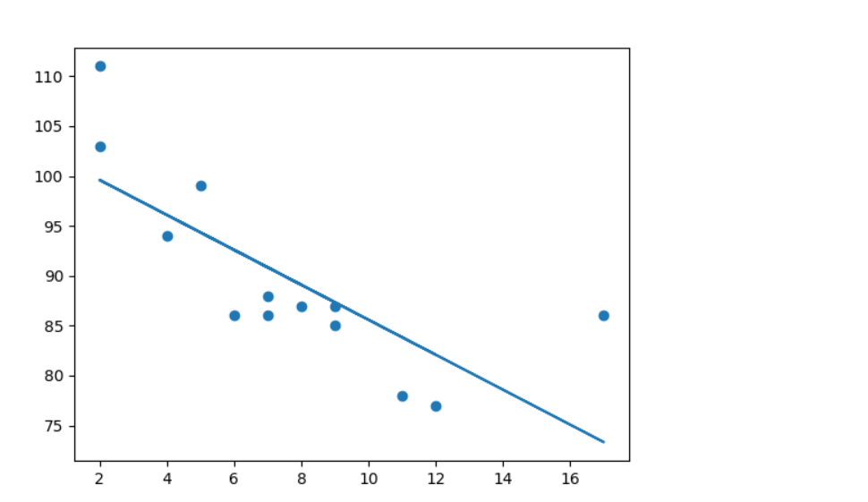
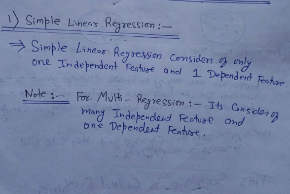
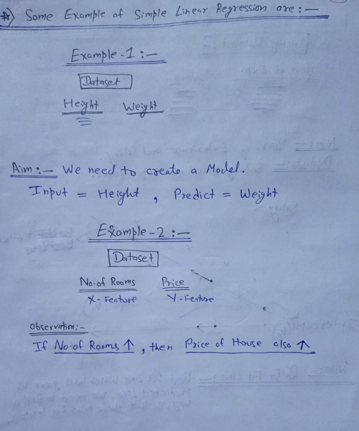
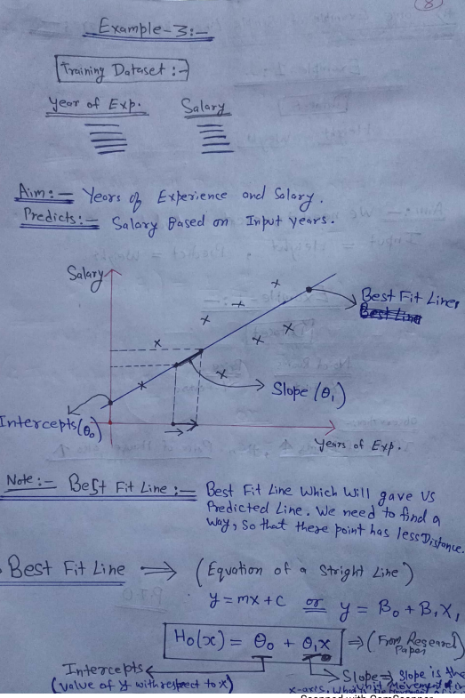
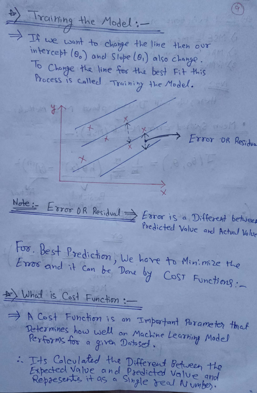
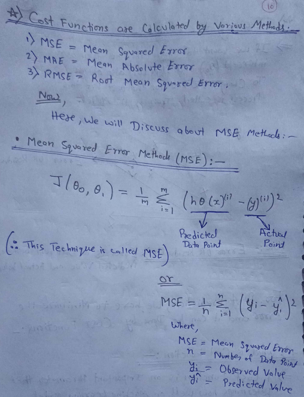

# Regression
The term regression is used when you try to find the relationship between variables.

In Machine Learning, and in statistical modeling, that relationship is used to predict the outcome of future events.

# Linear Regression
Linear regression uses the relationship between the data-points to draw a straight line through all them.

This line can be used to predict future values.

In Machine Learning, predicting the future is very important.
 

 

# Assumption of Linear Regression

Linear regression is a useful statistical method we can use to understand the relationship between two variables, x and y. However, before we conduct linear regression, we must first make sure that four assumptions are met:

1. Linear relationship: There exists a linear relationship between the independent variable, x, and the dependent variable, y.

2. Independence: The residuals are independent. In particular, there is no correlation between consecutive residuals in time series data.

3. Homoscedasticity: The residuals have constant variance at every level of x.

4. Normality: The residuals of the model are normally distributed.

If one or more of these assumptions are violated, then the results of our linear regression may be unreliable or even misleading.

In this post, we provide an explanation for each assumption, how to determine if the assumption is met, and what to do if the assumption is violated
You can see my notebook. All  the work is explained in detail.

 

### AUTHOR

<strong>Shehryar Gondal</strong>

You can get in touch with me on my LinkedIn Profile: 
 

You can also follow my GitHub Profile to stay updated about my latest projects: 

If you liked the repo then kindly support it by giving it a star ⭐.
